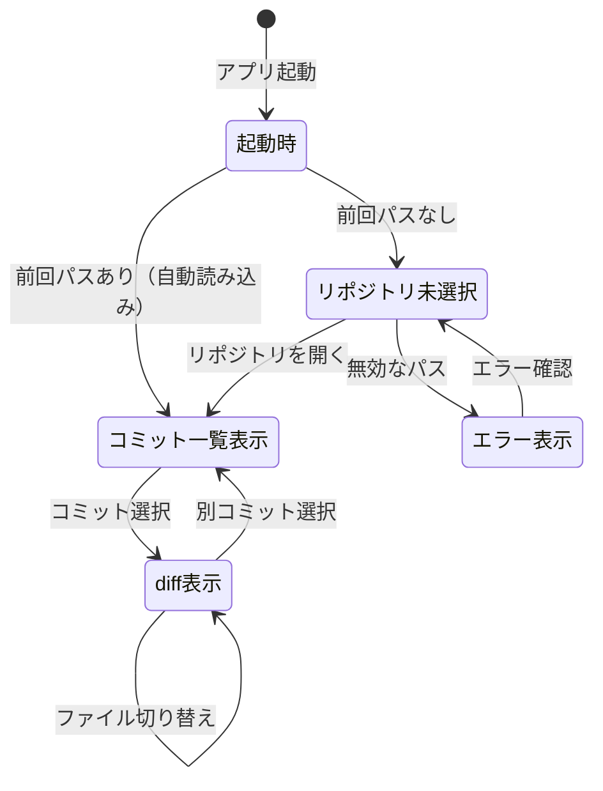

# 機能設計書 (Functional Design Document)

## システム構成図

```
┌─────────────────────────────────────────────────────┐
│                   egui UI レイヤー                   │
│  (ToolbarPanel / CommitListPanel / DiffPanel)        │
├─────────────────────────────────────────────────────┤
│                  App State レイヤー                  │
│  (AppState struct / イベント処理 / 状態遷移)          │
├─────────────────────────────────────────────────────┤
│                  Git ロジックレイヤー                 │
│  (git2 クレート / リポジトリ読み取り / diff 生成)     │
├─────────────────────────────────────────────────────┤
│                  永続化レイヤー                       │
│  (設定ファイル / 前回のリポジトリパス保存)             │
└─────────────────────────────────────────────────────┘
```

## 技術スタック

| 分類 | 技術 | 選定理由 |
|------|------|----------|
| 言語 | Rust | 軽量・高速・ネイティブバイナリ |
| GUI フレームワーク | egui (eframe) | 純Rust・軽量・クロスプラットフォーム |
| Git バックエンド | git2 | libgit2 バインディング・プロセス起動不要・高速 |
| 設定永続化 | serde + toml | シンプルな TOML シリアライズ |
| ビルドツール | Cargo | Rust 標準 |

## データモデル定義

### CommitInfo（コミット情報）

```rust
struct CommitInfo {
    oid: String,          // フルハッシュ (SHA-1)
    short_id: String,     // 短縮ハッシュ (7文字)
    message: String,      // コミットメッセージ（1行目）
    author: String,       // 著者名
    time: i64,            // Unix タイムスタンプ
    refs: Vec<String>,    // ブランチ名・タグ名のリスト
}
```

### DiffFile（差分ファイル情報）

```rust
struct DiffFile {
    path: String,         // ファイルパス
    status: FileStatus,   // 追加/変更/削除
    is_binary: bool,      // バイナリファイルフラグ
}

enum FileStatus {
    Added,
    Modified,
    Deleted,
    Renamed { old_path: String },
}
```

### DiffHunk（差分チャンク）

```rust
struct DiffHunk {
    header: String,       // @@ -x,y +a,b @@ ヘッダ
    lines: Vec<DiffLine>, // 差分行のリスト
}

struct DiffLine {
    kind: DiffLineKind,
    content: String,
}

enum DiffLineKind {
    Context,   // 変更なし（グレー）
    Added,     // 追加行（緑）
    Deleted,   // 削除行（赤）
}
```

### AppState（アプリ全体の状態）

```rust
struct AppState {
    repo_path: Option<PathBuf>,         // 現在開いているリポジトリパス
    path_input: String,                 // ツールバーのパス入力欄
    commits: Vec<CommitInfo>,           // コミット一覧
    selected_commits: Vec<usize>,       // 選択中コミットのインデックス(クリック順、最大2件)
    diff_files: Vec<DiffFile>,          // 選択コミットの変更ファイル一覧
    selected_file: Option<usize>,       // 選択中のファイルインデックス
    diff_hunks: Vec<DiffHunk>,          // 選択ファイルの差分
    needs_load: bool,                   // リポジトリ読み込みトリガー
    needs_diff_load: bool,              // diff ファイル一覧読み込みトリガー
    needs_file_load: bool,              // ハンク読み込みトリガー
    error_message: Option<String>,      // エラーメッセージ（表示用）
}
```

### AppConfig（設定・永続化）

```rust
struct AppConfig {
    last_repo_path: Option<String>,     // 前回開いたリポジトリパス
}
```

**保存先**: `%APPDATA%\gitwit\config.toml`

## コンポーネント設計

### ToolbarPanel

**責務**:
- 現在開いているリポジトリパスの表示
- 「開く」ボタンでリポジトリ選択ダイアログを表示
- テキスト入力でパスを直接入力する手段を提供

**インターフェース**:
```rust
fn show_toolbar(ctx: &egui::Context, state: &mut AppState)
// 戻り値: なし（state を直接更新）
```

### CommitListPanel

**責務**:
- コミット一覧をスクロール可能なリストで表示
- 各行にハッシュ・メッセージ・著者・日時・ブランチ名を表示
- 通常クリックで `selected_commits` を単一選択(1件)に更新し、diff 読み込みをトリガー
- Shift+クリックで `selected_commits` に追加し、最大2件のスライディング選択(3件目のShift+クリックで最も古いクリックの選択を追い出す)にする。2件選択時は時系列順(古い→新しい)でbase/targetを決定し、2コミット間の差分を読み込む

**インターフェース**:
```rust
fn show_commit_list(ui: &mut egui::Ui, state: &mut AppState)
```

### DiffPanel

**責務**:
- 右ペインを2分割して表示
  - 上部: 変更ファイル一覧 (`DiffFile` のリスト)
  - 下部: 選択ファイルの diff 表示 (`DiffHunk` リスト)
- ファイル選択で `selected_file` を更新し、diff 行を表示切り替え

**インターフェース**:
```rust
fn show_diff_panel(ui: &mut egui::Ui, state: &mut AppState)
```

### GitRepository（Git 操作ラッパー）

**責務**:
- `git2::Repository` をラップして、アプリに必要な操作だけを公開
- コミット一覧取得・diff 生成のロジックを集約

**インターフェース**:
```rust
struct GitRepository {
    inner: git2::Repository,
}

impl GitRepository {
    fn open(path: &Path) -> Result<Self, GitError>;
    fn load_commits(&self, limit: usize) -> Result<Vec<CommitInfo>, GitError>;
    fn load_diff_files(&self, oid: &str) -> Result<Vec<DiffFile>, GitError>;
    fn load_diff_hunks(&self, oid: &str, path: &str) -> Result<Vec<DiffHunk>, GitError>;
    // 2コミット間(base→target)の差分。base/targetの決定は呼び出し側(AppState)が時系列順で行う
    fn load_diff_files_between(&self, base_oid: &str, target_oid: &str) -> Result<Vec<DiffFile>, GitError>;
    fn load_diff_hunks_between(&self, base_oid: &str, target_oid: &str, path: &str) -> Result<Vec<DiffHunk>, GitError>;
}
```

## ユースケース図

### UC-1: リポジトリを開く

```
ユーザー         ToolbarPanel       GitRepository      AppState
   |                 |                   |                 |
   |-- [開く] クリック -->|                   |                 |
   |                 |-- ファイルダイアログ表示 -->|             |
   |-- パス選択 ------>|                   |                 |
   |                 |-- open(path) ------->|                 |
   |                 |                   |-- Ok(repo) ------->|
   |                 |                   |  repo_path を更新  |
   |                 |-- load_commits() -->|                 |
   |                 |                   |-- commits -------->|
   |                 |                   |  commits を更新    |
   |<-- コミット一覧表示 --|               |                 |
```

**エラーケース**: `open()` が失敗した場合、`error_message` に「Git リポジトリが見つかりません」を設定してダイアログを表示。

### UC-2: コミットを選択して差分を確認する

```
ユーザー      CommitListPanel    GitRepository      AppState
   |               |                 |                 |
   |-- コミット行クリック -->|           |                 |
   |               |-- selected_commits 更新 ------------>|
   |               |-- load_diff_files(oid) -->|         |
   |               |                 |-- files --------->|
   |               |                 |  diff_files 更新  |
   |<-- ファイル一覧表示 --|           |                 |
   |-- ファイル行クリック -->|           |                 |
   |               |-- load_diff_hunks(oid, path) ->|    |
   |               |                 |-- hunks -------->|
   |               |                 |  diff_hunks 更新 |
   |<-- diff 表示 --|               |                 |
```

### UC-3: Shift+クリックで2コミット間の差分を確認する

```
ユーザー      CommitListPanel    GitRepository      AppState
   |               |                 |                 |
   |-- コミット行Shift+クリック -->|     |                 |
   |               |-- selected_commits に追加(最大2件) ->|
   |               |-- selected_commits.len()==2 のため   |
   |               |   commits[idx].time で古い→新しいを決定|
   |               |-- load_diff_files_between(base, target) -->|
   |               |                 |-- files --------->|
   |               |                 |  diff_files 更新  |
   |<-- ファイル一覧表示(2コミット間) --|                 |
```

## 画面遷移図



## UI 設計

### レイアウト詳細

```
┌──────────────────────────────────────────────────────────────┐
│ [パス: C:\repos\my-project]              [📂 リポジトリを開く] │ ← ToolbarPanel (40px)
├────────────────────────┬─────────────────────────────────────┤
│ コミット一覧            │ 変更ファイル一覧                      │
│ (左: 40%)              │ (右上: 60%, 高さ30%)                 │
│                        │ > src/main.rs           [Modified]  │
│ ● abc1234             │   src/lib.rs            [Added]     │
│   feat: 新機能追加      ├─────────────────────────────────────┤
│   田中  2日前  [main]  │ diff 表示パネル                      │
│                        │ (右下: 60%, 高さ70%)                 │
│ ○ def5678             │  10│ fn main() {                   │
│   fix: バグ修正         │ -11│-    old_logic();              │
│   田中  3日前          │ +11│+    new_logic();              │
│                        │  12│ }                             │
└────────────────────────┴─────────────────────────────────────┘
```

### カラーコーディング（VSCode ライトモード準拠）

| 要素 | カラー | 用途 |
|------|--------|------|
| 背景 | `#FFFFFF` | メインパネル背景 |
| 選択行 | `#E8F0FE` | 選択中のコミット・ファイル行 |
| 追加行 | `#E6FFED` | diff の追加行（緑系） |
| 削除行 | `#FFEEF0` | diff の削除行（赤系） |
| コンテキスト行 | `#F6F8FA` | diff の変更なし行 |
| ブランチバッジ | `#0075CA` | ブランチ名バッジ背景 |
| タグバッジ | `#E99B00` | タグ名バッジ背景 |
| エラー文字 | `#D1242F` | エラーメッセージ |

### 日時表示フォーマット

| 経過時間 | 表示形式 | 例 |
|---------|---------|-----|
| 1時間以内 | `N分前` | `23分前` |
| 24時間以内 | `N時間前` | `5時間前` |
| 30日以内 | `N日前` | `3日前` |
| 30日以上 | `YYYY-MM-DD` | `2025-12-01` |

## ファイル構造（設定永続化）

**設定ファイルパス**: `%APPDATA%\gitwit\config.toml`

```toml
last_repo_path = "C:\\repos\\my-project"
```

**起動時の読み込みフロー**:
1. `%APPDATA%\gitwit\config.toml` を読み込む
2. `last_repo_path` があれば自動でリポジトリを開く
3. ファイルがない、またはパスが無効なら「リポジトリ未選択」状態で起動

## パフォーマンス最適化

- **コミット読み込みの上限**: 初期表示は 1,000 件まで。スクロール末尾で追加読み込み（仮想スクロール）
- **diff の遅延生成**: コミット選択時は変更ファイル一覧だけ取得し、ファイル選択後に diff 本文を生成（重い diff を事前計算しない）
- **バイナリ検出**: `DiffFile.is_binary == true` の場合、diff 生成をスキップしてプレースホルダを表示

## セキュリティ考慮事項

- **読み取り専用**: MVP では `git2::Repository::open()` のみ使用し、書き込み API は一切呼ばない
- **パスバリデーション**: ユーザー入力パスは `git2::Repository::open()` に渡すだけで検証を兼ねる（libgit2 が検証する）
- **大容量 diff の制限**: 1MB 超のファイルは diff 生成をスキップし、警告を表示する

## エラーハンドリング

### エラーの分類

| エラー種別 | 発生条件 | ユーザーへの表示 |
|-----------|---------|-----------------|
| `NotARepository` | 指定パスが Git リポジトリでない | 「Git リポジトリが見つかりません: {path}」 |
| `PermissionDenied` | ディレクトリへのアクセス権限がない | 「リポジトリを開く権限がありません」 |
| `CorruptedRepo` | `.git` が破損している | 「リポジトリが壊れている可能性があります」 |
| `BinaryFile` | バイナリファイルの diff 要求 | 「バイナリファイルのため差分を表示できません」 |
| `LargeFile` | 1MB 超のファイル diff | 「ファイルが大きすぎます（{size}MB）。表示をスキップします」 |

## テスト戦略

### ユニットテスト
- `GitRepository::load_commits()`: テスト用リポジトリ（一時ディレクトリに `git init`）を使って検証
- `DiffLine` パーサー: 各 `DiffLineKind` の正しい分類を検証
- 日時フォーマット関数: 各経過時間パターンの表示文字列を検証

### 統合テスト
- リポジトリを開く → コミット一覧取得 → diff 取得 の一連フローをテスト用リポジトリで検証

### 手動テスト（E2E）
- 実際のリポジトリ（このプロジェクト自身）で動作確認
- 大きなリポジトリ（1,000 コミット超）でのパフォーマンス確認
